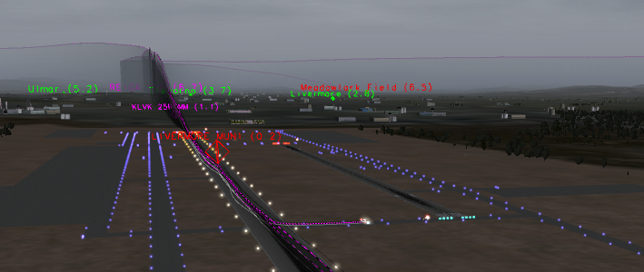

# 3D visualization plugin for the x-plane flight simulator. #

## News ##
  * ## updating project after move to github ##
    * google code was shutting down. moved the project to github, but hadn't really updated it much.

## **Installing** the plugin. ##

  * Download one of the XPL files for your platform.
    * [\*Windows\*](xsa-ng-win.xpl)
    * [\*Mac x86\*](xsa-ng-mac.xpl)

  * Check for, and delete any old copies of the plugin, before copying the new one into place.
    * _The file names in the download section will change between versions._
    * _Having two or more version of the plugin running will have unpredictable results._
  * Place the _.xpl_ file in `<x-plane install directory>/Resources/plugins` directory.

That's it.

## Using the plugin ##

The base plugin setup (no landmarks data file) will use the built in x-plane database to render airports, navaids and fixes without any additional setup.

You simply download the 'xpl' as noted above, put it in the plugins directory, start X-Plane and start using the plugin.

The plugin is configured via the "plugins" menu in X-Plane, so when you first start X-Plane, you may not see any 3D output from the plugin, unless you've selected rendering optins from the XSA-NG configuration menu.

## Using USGS data with the plugin. ##

If you want additional functionality with the plugin, you can download and use a data file with 'points' data in it.

I've provided a 'points' file that uses USGS landmark data.

(coming soon) You can download this file from [xdata.zip](xdata.zip).

Unzip the file so that it extracts the 'xdata.dlm` file, and place the file in the root of your x-plane install directory.

Once you've done that, start x-plane, and configure some of the advanced 'points' options in the Civil, Terrain etc option groups.

In order to maintain performance, the plugin may take a few seconds to load the 'points' data for the area you are in, so once you've turned the options on, be patient. Any 'points' that are available in the data for your area should show up.

If you change areas through the X-Plane menus, it again may take the plugin a few seconds to load the points in the area you've just moved to.

That's it.

I've enjoyed making the plugin, and I find that having it really enhances my enjoyment of VFR flying, especially with "heavies", since the plugin gives me many more options for having visual "landmarks" to be able to use, when dead reckoning, or lining up approaches.

Enjoy.

Tony